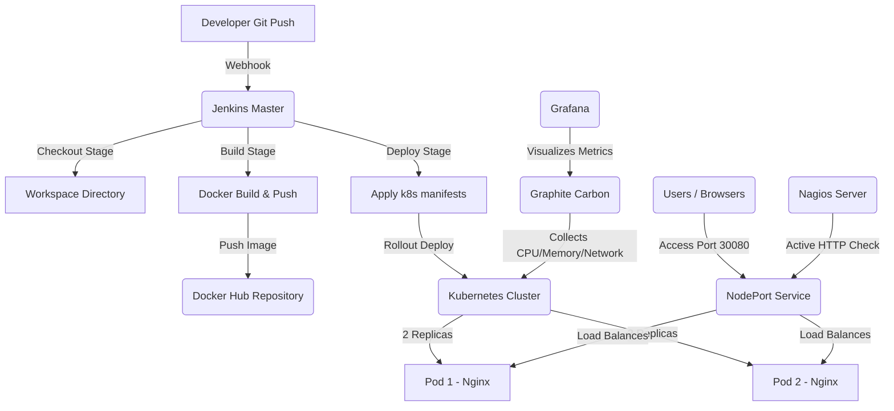

# DEVOPS COURSE LABORATORY REPORT

---

## Student details and metadata

| Detail | Value |
| :--- | :--- |
| **Student Name** | Dhruv Jain |
| **Registration Number** | 24BIT0379 |
| **Course Code / Title** | DevOps Assignment / Laboratory Coursework |
| **Use Case Selected** | Use Case 1: Corporate Company Website Deployment |
| **GitHub Repository Link** | [24BIT0379_DhruvJain_DevOps-Project](https://github.com/Drv4ever/24BIT0379_DhruvJain_DevOps-Project.git) |
| **Submission Date** | July 6, 2026 |

---

<div style="page-break-after: always;"></div>

## 1. Executive Summary & Objective

This report details the implementation of a production-grade DevOps CI/CD pipeline for **ABC Technologies**, a corporate company website. The objective of this assignment is to execute a complete development lifecycle workflow including:
1. **Application Development**: Creating a professional, styled, responsive HTML5 corporate landing page containing *Home, About Us, Services, Careers, Contact Us,* and *Gallery* sections.
2. **Containerization**: Wrapping the static assets using an Nginx base image in a lightweight `Dockerfile` for portability.
3. **Orchestration**: Deploying the containerized application onto a multi-replica Kubernetes cluster using deployment manifests and exposing it via a `NodePort` service.
4. **CI/CD Automation**: Building a fully declarative Jenkins pipeline to automatically pull code, build the container, and deploy to Kubernetes.
5. **Observability and Monitoring**: Configuring local monitoring tools (**Nagios**, **Graphite**, and **Grafana**) to collect metrics, monitor resource usage, track website uptime, and alert on availability.

---

## 2. System Architecture

The following diagram illustrates the workflow and data paths of the pipeline:



---

## 3. Step-by-Step Implementation

### Step 3.1: Application Code Development

A professional corporate page for "ABC Technologies" was designed using modern responsive layouts, CSS variables, Google Fonts (`Outfit` and `Plus Jakarta Sans`), and glassmorphism styling. 

* **File Path in Repository:** `index.html`

```html
<!-- Code Snippet of Header & Home Sections -->
<!DOCTYPE html>
<html lang="en">
<head>
    <meta charset="UTF-8">
    <title>ABC Technologies | Elevating Enterprise Innovation</title>
    ...
```

#### Application Interface Verification
Below is the screenshot showing the locally loaded corporate web interface:

```
[INSERT SCREENSHOT HERE: Local Browser View of ABC Technologies index.html / Home Section]
```

---

### Step 3.2: Containerization (Docker)

To run the application consistently across environments, a `Dockerfile` was created using `nginx:alpine` as the base image. The static site assets are copied to `/usr/share/nginx/html/` and port `80` is exposed.

* **File Path in Repository:** `Dockerfile`

```dockerfile
FROM nginx:alpine
COPY index.html /usr/share/nginx/html/index.html
EXPOSE 80
```

#### Docker Build and Docker Hub Repository Verification
Below are the details and screenshot verification of the built Docker image:

* **Docker Hub Link:** `https://hub.docker.com/repository/docker/drv4ever/abc-tech-website`
* **Docker Hub Repository Dashboard:**

```
[INSERT SCREENSHOT HERE: Docker Hub Repository Page showing successfully pushed tag 'latest']
```

---

### Step 3.3: Kubernetes Orchestration

A multi-replica Kubernetes setup is specified to ensure high availability. The manifest includes a Deployment with **2 replicas** and a Service configured with type **NodePort** mapping incoming port `30080` to the container port `80`.

* **File Path in Repository:** `k8s-deployment.yaml`

```yaml
apiVersion: apps/v1
kind: Deployment
metadata:
  name: abc-tech-deployment
...
```

#### Kubernetes Cluster Deployment Verification
Below is the verification showing active Kubernetes pods and services running on the cluster:

```
[INSERT SCREENSHOT HERE: Terminal Output of 'kubectl get pods,svc' showing 2 Running Pods and NodePort Service mapping port 30080]
```

---

### Step 3.4: Jenkins Declarative CI/CD Pipeline

A declarative `Jenkinsfile` orchestrates the checkout of the source code, builds the container image locally, and deploys it onto the Kubernetes cluster.

* **File Path in Repository:** `Jenkinsfile`

```groovy
pipeline {
    agent any
    stages {
        stage('Checkout') { ... }
        stage('Build') { ... }
        stage('Deploy') { ... }
    }
}
```

#### Jenkins Pipeline Run Verification
Below are the build logs, dashboards, and verification details:

* **Jenkins Build Job URL:** `http://localhost:8080/job/abc-tech-pipeline/`
* **Jenkins Console Output / Pipeline Stage View:**

```
[INSERT SCREENSHOT HERE: Jenkins Stage View showing successful Checkout, Build, and Deploy stages]
```

---

## 4. Monitoring, Observability, and Metrics Setup

To guarantee system stability, local observability agents were configured to fetch node statistics and application availability.

### 4.1: Nagios Monitoring

Nagios Core checks host availability and validates that Nginx is running properly on port 30080 by performing periodic HTTP probes.

#### Nagios Verification
Below is the status console showing host health and HTTP endpoint status:

```
[INSERT SCREENSHOT HERE: Nagios host status page showing Host UP and HTTP Service OK on NodePort 30080]
```

---

### 4.2: Graphite Metrics Collection

System performance statistics (CPU, memory consumption, network load) are aggregated and pushed to Graphite Carbon.

#### Graphite Interface Verification
Below is the Graphite dashboard view plotting telemetry variables:

```
[INSERT SCREENSHOT HERE: Graphite Composer rendering metric paths showing system memory or CPU usage over time]
```

---

### 4.3: Grafana Dashboard Visualization

Grafana is linked to Graphite as a data source to build responsive dashboards monitoring cluster health, uptime statistics, network utilization, and service HTTP response codes.

#### Grafana Telemetry Verification
Below is the unified dashboard showing system health metrics:

```
[INSERT SCREENSHOT HERE: Grafana Dashboard showing CPU, Memory, Network Usage, HTTP Availability, and Uptime widgets]
```

---

## 5. Deployment Verification URL

The application is deployed on local Kubernetes nodes and accessible via:
* **Local Web Address:** [http://localhost:30080](http://localhost:30080)

```
[INSERT SCREENSHOT HERE: Browser view accessing ABC Technologies at http://localhost:30080]
```

---

## 6. Conclusion & Learnings

The assignment successfully demonstrates the application of modern DevOps tools. The declarative workflow ensures reproducible configurations. 
* Containerizing the Nginx site ensures environmental consistency.
* Kubernetes deployment abstracts container scaling.
* Jenkins automates the build-measure-learn loop.
* Observability stack (Nagios, Graphite, Grafana) provides live telemetry, critical for SLA verification and operations management.
